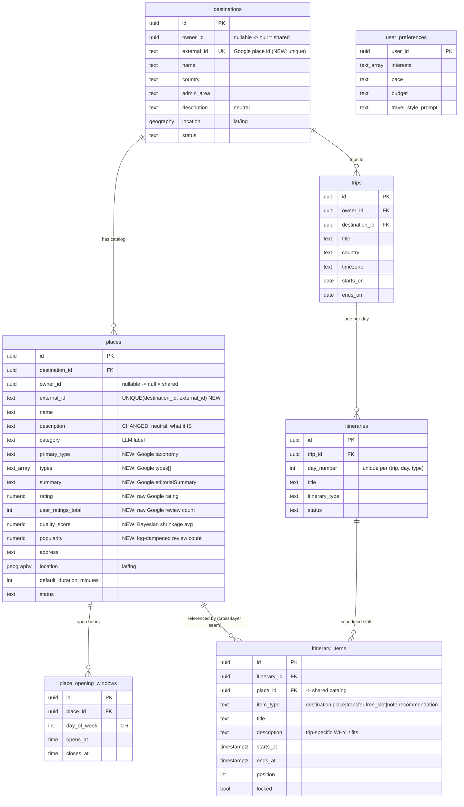

# Proposed schema: shared place catalog + trip layer

> Design note for discussion with the itinerary assignee.
> Status: **proposal** — not yet migrated.

## Goal

Turn the place catalog into a **durable, global, shared store** so we hit the
Google Places API only on cold-start or to fill gaps — never on every trip.
Itinerary generation reads from this catalog; it does **not** call Places.

## Two layers

**Layer 1 — Shared catalog (global, read-all-authenticated, system-written).**
`destinations`, `places`, `place_opening_windows`. Deduped and reused across all
users and trips. Descriptions here are **neutral** ("what the place *is*").
Nobody "owns" these rows.

**Layer 2 — Trip plan (per-user, owner-scoped).**
`trips` → `itineraries` → `itinerary_items`. This is where a trip's *scheduling*
and *trip-specific rationale* live. `itinerary_items` reference shared `places`
by FK but hold their own `description` ("why this place fits *this* trip").

The seam: **`itinerary_items.place_id` → `places.id`** is the only cross-layer
link. The itinerary generator *reads* the shared catalog and *writes* only
Layer 2.

## Schema deltas

### `destinations`
- Add `UNIQUE (external_id)`; route upserts on it (today it inserts a fresh row
  every run — the root reason nothing is reusable).
- `owner_id` → nullable; catalog rows are system-owned (`null`). Read policy
  already allows all authenticated to read `status='active'`, so reads are fine.

### `places`
- Add `UNIQUE (destination_id, external_id)` — the dedup key; also makes inserts
  idempotent upserts (kills the duplicate-row bug).
- `owner_id` → nullable (`null` = shared catalog row).
- **New columns** carrying Google signal we currently throw away:
  `primary_type text`, `types text[]`, `summary text`.
- **New scoring columns** for ranking (must-see vs filler):
  - `rating numeric` and `user_ratings_total int` — **raw** Google inputs, stored
    so the score can be re-tuned without re-hitting Places.
  - `quality_score numeric` — Bayesian/shrinkage average (see Scoring below);
    quality on the 1–5 scale, popularity-resistant.
  - `popularity numeric` — log-dampened `user_ratings_total`; separate axis so
    the scheduler can weight "hidden gems" vs "first-time must-sees" per trip.
- `description` semantics change to **neutral / trip-agnostic**.
- RLS: read-all authenticated; writes restricted to the catalog service path
  (service-role), not user sessions.

### `itinerary_items` (no structural change — clarified usage)
- `description` = the **trip-specific** "why it fits," written by the itinerary
  generator.
- Scheduling lives here: `starts_at`, `ends_at`, `position`, `item_type`,
  `locked`.

## Scoring (how `quality_score` / `popularity` are derived)

Do **not** use `rating × review_count` — it collapses into a popularity ranking
(rating is bounded 1–5, count spans orders of magnitude), burying the hidden gems
the catalog exists to surface.

**`quality_score` — Bayesian / shrinkage average** (IMDb-style weighted rating).
Shrinks low-confidence ratings toward the catalog mean instead of multiplying:

```
quality_score = (v / (v + m)) · R  +  (m / (v + m)) · C
```

- `R` = place average rating, `v` = place review count
- `C` = mean rating across the catalog (the prior)
- `m` = confidence threshold ("reviews before I trust the rating"; tune ~50–200)

Few reviews → near `C`; many reviews → approaches true `R`. Stays on the 1–5
scale; popularity can't steamroll quality.

**`popularity` — log-dampened count** (separate axis, for must-see weighting):

```
popularity = log10(user_ratings_total + 1)   -- 100 reviews = 2, 100k = 5
```

Scheduler blends them per trip, e.g. `priority = w1·quality_score + w2·popularity`
— "hidden gems" trips weight quality; "first time in Paris" weights popularity.

> Store `rating` + `user_ratings_total` **raw**; compute `quality_score` /
> `popularity` on write (or in a view) so `C`/`m` can be re-tuned without
> re-fetching from Places.

## Read/write contract for the itinerary generator

**Reads (Layer 1, per place):** `name`, `category`, `primary_type`, `types`,
`summary`, `description`, `location` (lat/lng), `default_duration_minutes`,
`quality_score` / `popularity` (ranking), and `place_opening_windows` (when
populated). Plus trip context
(`trips.starts_on/ends_on/timezone`) and `user_preferences`.

**Writes (Layer 2):** one `itineraries` row per `day_number`; `itinerary_items`
rows with `place_id`, `starts_at`/`ends_at` (must satisfy `starts_at < ends_at`),
`position` (0-based), `item_type ∈ {destination, place, transfer, free_slot,
note, recommendation}`, and the trip-specific `description`.

## ER diagram

> Also available standalone in [`shared-catalog-schema.mmd`](./shared-catalog-schema.mmd).



## Open items to flag with the assignee

1. **Opening hours are unpopulated.** The `place_opening_windows` table exists
   but the catalog loop never fills it, and the Places field mask doesn't fetch
   hours. Until we add that, the scheduler can do duration-packing + geo-
   clustering but **not** "is it actually open then." Decide if v1 needs it.
2. **`category` is free-text from the LLM.** For reliable "group museums / meals
   at meal times," prefer `primary_type`/`types` (Google taxonomy) once
   persisted.
3. **Ranking** — addressed by `quality_score` / `popularity` (see Scoring).
   Open sub-question: pick the `m` confidence threshold, and decide default
   `w1`/`w2` blend weights for the scheduler.
